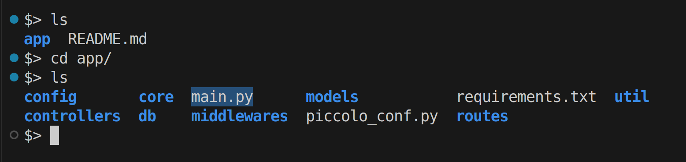

# 01. Setup and Run

[&LeftArrow; Back](README.md)

In order to setup and run, you need to:

**Step-1:** Download 
**Step-2:** Install Dependencies 
**Step-3:** Update Configurations 
**Step-4:** Run & Verify

## Step-1: Download

There are many ways to download server

#### Method-1: Download Repo Zip

- Goto URL [github.com/EigenSol/fast-api-backend-server](https://github.com/EigenSol/fast-api-backend-server)

- Click on **Code** and then **Download ZIP**

  

- Unzip and you will see following folders and files:

  

#### Method-2: Clone

- Run command `git clone https://github.com/EigenSol/fast-api-backend-server.git`
- And it will clone the repository with same folders and files

#### Method-3: Download Release `v0.1-alpha`

- Visit url [https://github.com/EigenSol/fast-api-backend-server/archive/refs/tags/v1.0-alpha.zip](https://github.com/EigenSol/fast-api-backend-server/archive/refs/tags/v1.0-alpha.zip)
- And Downlaod release created at this time (when these notes are written).

## Step-2: Install Dependencies

- There is a `requirements.txt` in `app/` folder.

- First make sure you are right folder by running `ls` command. And find `requirements.txt`

  

- Run command `pip3.13 install -r requirements.txt` to install all dependencies

  

## Step-3: Update Configurations

- You need a `.env` file for running this server
- There is no `.env` file, But you can copy `.env.dev` to make `.env`
  
- And write your **Postgress** credentials in it

## Step-4: Run and Verify

Run:
- For running server, you must be in same folder where `main.py` is located
- Use `ls` and `cd` commands to verify
  
- Run `python main.py` and it will start server.
  

Verify:
- Visit given url ([http://127.0.0.1:7003/](http://127.0.0.1:7003/)) in browser
- And you can see success message
  

## Conclusion

For every project or task, you can make a fresh server using these 4 simple steps.

[&LeftArrow; Back](README.md)
