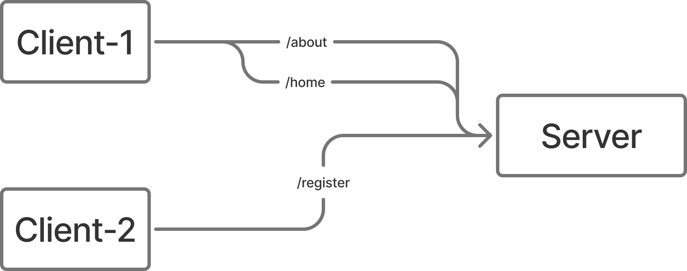
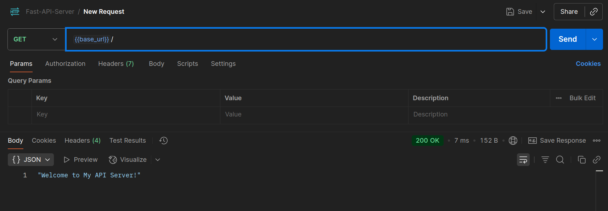

# 02. Routing Basics

[&LeftArrow; Back](README.md)

Let's understand:
1. Parts of a URL
2. Client / Server Model
3. How our API server does routing
4. Some basic routing examples
5. Request Methods

## 1. Parts of a URL

Study parts of url from following diagram:


## 2. Client / Server Model

In an API server or a web server:
- There are many clients connected to a server.
- Each client can send more than one requests.




## 3. How our API server does routing

An API server is:
- a code
- that will only know the "url" (path) of requeest
- and it will send a reply

How does routing plays an important role:
- Instead of write a very big code that will respond to every single request
- Developers created one function for each path
- and then when a request comes from server, it just simply calls that function
- This is how we are splitting code in our server as well.

## 4. Some basic routing examples

First of all, create a fresh app (according to [#01](01_setup_and_run.md))

#### Start fresh

In order to start fresh, delete all routes in `routes/routes.py` file:

```py
routes = [

]
```

Also remove root route from `main.py`:
```py
...
# remove following lines

# Root Endpoint

@app.get("/")
async def root():
    return {"message": "API is up and running!"}
...
```

Now start the API server using `python main.py`
and test using postman.


We can see it is returning 404 error.

Following is how our API server is handing incoming request


Right now:
- request came
- it serached for a function matching `/`
- No such function existed
- Hance it returned Error 404 (not found)

#### Home Route

Let's add a home route
That is always matched at `/`

In file `routes/routes.py`, write a function that will return "Welcome to API" whenever user visits path `/`:

```py
async def welcome_function(request):
  return "Welcome to My API Server!"

routes = [
  {'method': 'GET', 'path': '/', 'handler': welcome_function}
]
```

Now let's test in Postman:



We're getting output from our function.

#### Lets add more routes also

```py
async def welcome_function(request):
  return "Welcome to My API Server!"

async def about(request):
  return "About Us"

async def technologies(request):
  return "Our Technologies"

async def team(request):
  return "Our Team"


routes = [
  {'method': 'GET', 'path': '/',             'handler': welcome_function },
  {'method': 'GET', 'path': '/about',        'handler': about            },
  {'method': 'GET', 'path': '/technologies', 'handler': technologies     },
  {'method': 'GET', 'path': '/team',         'handler': team             },
]
```

And we can visit all 4 endpoints in browser or postman:


#### Request Methods

Common HTTP Methods:

| Method | Description                  | Has Body? | Idempotent | Safe    |
|--------|------------------------------|-----------|------------|---------|
| GET    | Retrieve data                | ❌        | ✅         | ✅      |
| POST   | Submit data (create)         | ✅        | ❌         | ❌      |
| PUT    | Replace resource             | ✅        | ✅         | ❌      |
| PATCH  | Partial update               | ✅        | ❌         | ❌      |
| DELETE | Remove resource              | ❌/✅     | ✅         | ❌      |
| HEAD   | Like GET, but header only    | ❌        | ✅         | ✅      |
| OPTIONS| Get allowed methods          | ❌        | ✅         | ✅      |

> **DELETE** may have a body but it's generally not used.

##### RESTful Standards

REST = Representational State Transfer  
Follows stateless, resource-based architecture.

##### REST Conventions

- **Resource Naming**
  - Use nouns (e.g., `/users`, `/orders`)
  - Avoid verbs (e.g., `/getUsers` ❌)

- **HTTP Methods on Resources**
  - `GET /users` → list users
  - `GET /users/1` → get user 1
  - `POST /users` → create user
  - `PUT /users/1` → replace user 1
  - `PATCH /users/1` → update part of user 1
  - `DELETE /users/1` → delete user 1

- **Status Codes**
  - `200 OK`, `201 Created`, `204 No Content`
  - `400 Bad Request`, `404 Not Found`, `500 Server Error`

##### Good Practices
- Stateless interactions
- Use proper status codes
- Versioning via URI: `/api/v1/users`

#### A RESTful CRUD

What is a CRUD ?

- Create
- Read
- Update
- Delete

When we make all above 4 endponits (routes) for an entity / resource, we call it a CRUD.

As we already studied which methods / endpoints are made in a RESTful standard.

Lets code on in our API server:

```py
async def get_todos(req):
  return [{"id": 1, "task": "Buy milk"}, {"id": 2, "task": "Read book"}]

async def get_todo(req):
  return {"id": 1, "task": "Buy milk"}

async def create_todo(req):
  return {"id": 3, "task": "New task created"}

async def update_todo(req):
  return {"id": 1, "task": "Updated task"}

async def delete_todo(req):
  return {"msg": "Task deleted"}

routes = [
  {'method': 'GET',    'path': '/todos',   'handler': get_todos   },
  {'method': 'GET',    'path': '/todos/1', 'handler': get_todo    },
  {'method': 'POST',   'path': '/todos',   'handler': create_todo },
  {'method': 'PUT',    'path': '/todos/1', 'handler': update_todo },
  {'method': 'DELETE', 'path': '/todos/1', 'handler': delete_todo },
]
```
> **Quick note:** we can only test GET methods in browser, for other methods we need a tool (like Postman) in order to send requests and check output.

Let's open /todos and /todos/1 in our browser


Now for `POST`, `PUT` and `DELETE`, we need Postman to send requests:


So now we have learnt:

1. How routing works
2. How to make a simple routing table, that will call handler functions on matching requests
3. We know howe we can use different methods in routing

Using this knowledge:
- You can make a routing table for a smiple and static website

Next Up:
- we shall learn in #3, advanced routing techniques

Stay tuned !

[&LeftArrow; Back](README.md)
