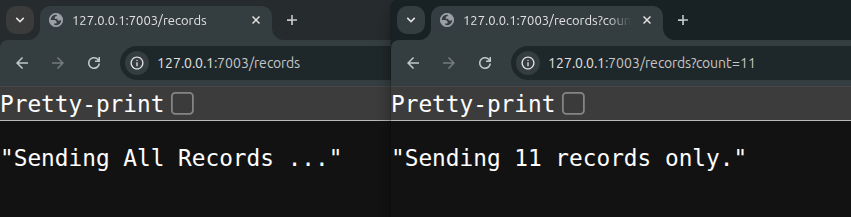
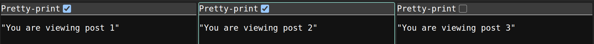
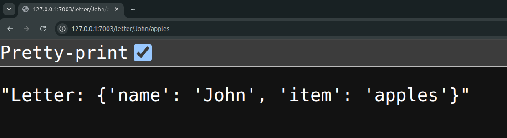
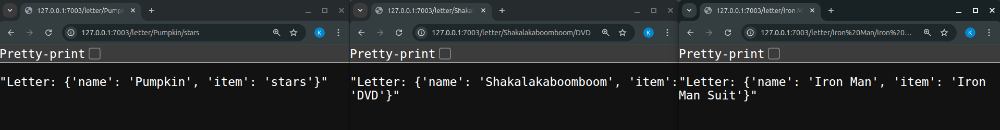
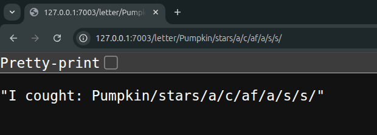

# 03. Advanced Routing

[&LeftArrow; Back](README.md)

In our previous topic, we already learnt how to make routes. Today, we shall learn how we can make "smart routes".

Let's discuss:

1. Query params
2. Path params
3. Middlewares
4. Grouped Routing

### 1. Query params

If we have a path. Like `/records`. In this route, we can pass some data to our handler function using query parameters.

Query parameters are designed for this purpose:
- to send some data to a single path

For example, if i write

```py
async def records(req):

  # get count
  count = req.query_params.get('count')

  # if no count given
  if not count: return "Sending All Records ..."

  # if count given
  return f"Sending {count} records only."


routes = [
  {'method': 'GET', 'path': '/records', 'handler': records  },
]
```

and then i can visit same path with different query parameters:



### 2. Path Params

Let suppose, we have 3 posts.

A beginner will show them like this:

```py
async def post_one(req):
  return "You are viewing post 1"

async def post_two(req):
  return "You are viewing post 2"

async def post_three(req):
  return "You are viewing post 3"


routes = [
  {'method': 'GET', 'path': '/posts/1', 'handler': post_one  },
  {'method': 'GET', 'path': '/posts/2', 'handler': post_two  },
  {'method': 'GET', 'path': '/posts/3', 'handler': post_three},
]
```

And users can visit these posts in browser like:



But a smart developer can write a a short code like:

```py
async def post(req):
  pid = req.path_params.get('id')
  return f"You are viewing post {pid}"

routes = [
  {'method': 'GET', 'path': '/posts/{id}', 'handler': post  },
]
```

And output is the same


Let's see how it works:

- When you write something in curly braces, like `{id}`
- It is called a "Path Parameter" or a "Route Parameter"
- Whatever user writes in that part of route, it will get copied to a variable with name inside of brackets (like `id`)
- And then you can get it in handler function using `req.path_params`

Just for fun, lets make a fun route:

```py
async def letter(req):
  return f"Letter: {req.path_params}"

routes = [
  {'method': 'GET', 'path': '/letter/{name}/{item}', 'handler': letter  },
]
```

and test in browser:



Wow! we just printed all routes dict in browser.

Lets keep the code same, but visit with different names:



And this is one last magic remaining:

- `{name}` will only match `/a/` or `/b/` or `/c/`
- But it will not match `/a/b/c/`
- If we type `{name:path}`, then it will match "everything that comes after that" (even with slash), so it becomes `/a/b/c/` as `name` in `req.path_params` dict.

Let's try coding something like:

```py
async def all_rounder(req):
  return f"I cought: {req.path_params['name']}"

routes = [
  {'method': 'GET', 'path': '/letter/{name:path}', 'handler': all_rounder  },
]
```

Now even if i visit a long name, it is catching complete remaining path after `{...:path}` path param:



### 3. Middlewares

A middleware is like a gatekeeper:
- It judges the incoming request
- and decides weather it will allow request to go to handler function or not

In our api server, a middleware is a class.

Let's learn more by coding

```py
from core.Middleware import Middleware

class AdminCheckMiddleware(Middleware):

  async def next(self, req, handler):

    if 'admin' not in req.query_params:
      return "You are not allowed !!"
    
    else:
      return await handler(req)


async def dashboard(req):
  return "Admin Dashboard"

routes = [
  {
    'method': 'GET',
    'path': '/admin',
    'middleware': AdminCheckMiddleware,
    'handler': dashboard,
  },
]


```

This simply means:
- Hey `/admin` request, you will call `dashboard` handler
- But only if `AdminCheckMiddleware` allow you

And in our middleware, we have code:
- If there is `admin` in query param, then allow calling `dashboard` function.
- Otherwise do not allow and block code from calling `dashboard` function

A few notes for middleware in our server:
- Middleware is always a class with `Middleware` parent class
- There is always a `next` function in each middleware class
- This function always accept `req` (request) and `handler`
- In this `next` function, if we return `await handler(req)`, then next function is called (allowed)
- But if we return something else, it will block next function call and return output to client.

### 4. Grouped Routing

@pending-notes

[&LeftArrow; Back](README.md)
